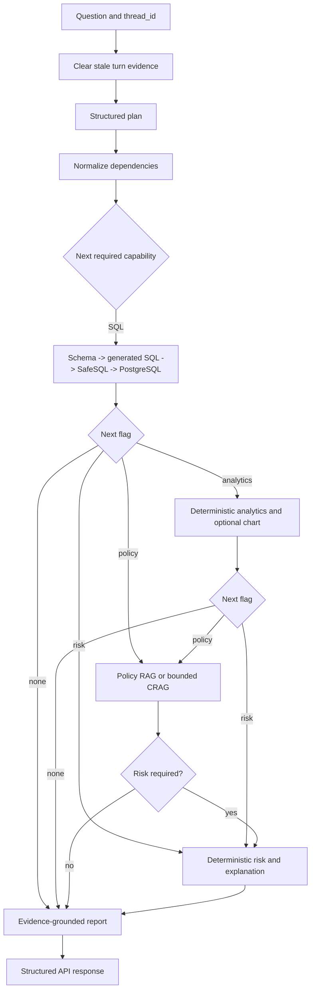

# Investigation Data Flow

## Primary Investigation

1. FastAPI validates a question and `thread_id`, assigns or preserves a request ID, and calls `InvestigationService`.
2. `InvestigationService` invokes the compiled LangGraph with the question, a human message, and checkpoint configuration.
3. `prepare_turn` clears plan, SQL, analytics, policy, risk, and report fields from the previous turn while preserving bounded conversation messages.
4. The Planner receives the current question plus bounded recent conversation context and produces a structured `InvestigationPlan`.
5. Deterministic dependency normalization makes SQL mandatory for analytics and risk work.
6. Deterministic routers select the next specialist from explicit plan flags.
7. When SQL is required, the SQL Analyst inspects the permitted schema, proposes SQL, and passes it to SafeSQL. SafeSQL parses and validates a single read-only statement, applies bounds, and executes through `financial_reader` against PostgreSQL.
8. When analytics is required, the Data Analyst receives only the retrieved rows and performs constrained deterministic calculations. Eligible output may produce a typed, bounded chart artifact.
9. When policy evidence is required, the Policy Agent performs Qdrant retrieval. The CRAG path evaluates relevance and permits at most one rewritten retrieval before declaring insufficient evidence.
10. When risk is required and exactly one transaction row is available, the deterministic risk engine calculates the score, level, signals, and ruleset version. The Risk Agent explains that result using available policy evidence.
11. The evidence builder copies authoritative turn-scoped SQL, analytics, chart metadata, policy, and risk results into a structured bundle. It does not recalculate specialist outputs.
12. Model-facing conversation and evidence are bounded before use; required evidence must not be silently discarded.
13. The Report Agent synthesizes an investigation report from the evidence bundle and has no operational action tools.
14. The graph returns the structured result through `InvestigationService` and FastAPI.
15. When a PostgreSQL checkpointer is supplied, LangGraph persists conversation state under the investigation `thread_id`.
16. Long-term memory is optional and separate. A deterministic policy decides eligibility; stored records are concise, retained for a bounded period, and deletable by stable ID.
17. Any customer-impacting recommendation remains a recommendation. A separate approval workflow must authorize the exact action and arguments before deterministic execution.

## Specialist Sequence

## Evidence Lifetime

Specialist results are authoritative only for the current turn. Checkpointed messages provide conversational continuity, not permission to reuse stale financial facts. Current database retrieval and current policy retrieval must be performed again whenever the new request requires authoritative evidence.

## Controlled-Action Flow

The investigation graph may recommend an action but cannot execute it. Proposal creates a pending approval. A human approves or rejects it. Execution locks and validates the record, compares the exact action and arguments, applies the mutation once, consumes the approval, and writes the success audit atomically. Denials are audited separately.
