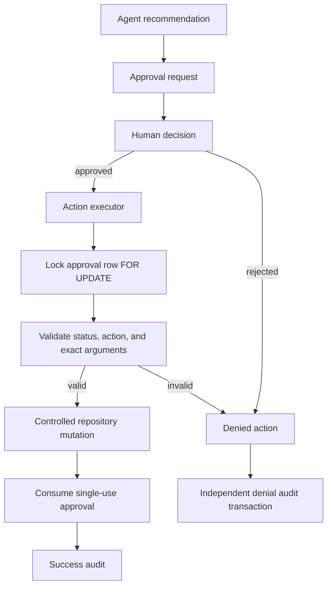
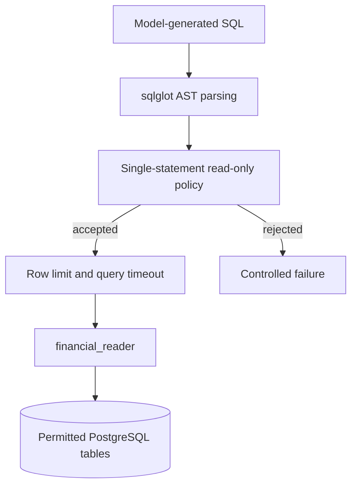

# Security Architecture

## Trust Model

User input, model output, generated SQL, retrieved content, tool output, MCP responses, and historical memory are untrusted until deterministic application controls validate their use. Prompts describe desired behavior but do not grant authority.

## Customer-Impacting Actions

LLM recommendations do not execute actions. Protected execution requires explicit approval, exact action and argument matching, single-use authorization, row-lock concurrency protection, controlled deterministic mutation, and authoritative auditing.

Account mutation, approval consumption, and success audit persistence share one database transaction. If any part fails, all three roll back. A denied attempt first rolls back the protected-action transaction and then records a sanitized reason code through an independent audit transaction, ensuring the security event is not discarded with the denial.

The currently supported freeze action is application-controlled; arbitrary model-generated mutation SQL is never accepted.

## SQL Defense in Depth

SafeSQL validation and least-privilege database authorization are independent boundaries. Approval and audit tables are excluded from the model-facing reader role.

## Retrieval and Prompt Injection

Retrieved documents are evidence, not instructions. Retrieval content cannot override system instructions, tool permissions, SQL policy, approval requirements, or loop limits. CRAG relevance evaluation is bounded and an unsupported policy question terminates with insufficient evidence.

## Resource Controls

Reusable loop and context controls enforce iteration, tool-call, repeated-action, failed-operation, token, cost, and context budgets. Unknown pricing fails closed when a strict cost budget is configured. These controls are deterministic runtime state, not model self-reporting.

## Capability Boundaries

Specialists receive only the capabilities needed for their role. The report agent receives evidence but no operational mutation tools. MCP handlers reuse the same validated application capabilities and cannot bypass approval or database controls.

## Secrets, Logs, Traces, and Audit

Credentials are supplied through environment variables and must not enter model context, logs, traces, or audit details. Request IDs correlate API logs and traces; thread IDs identify conversation continuity. Neither is an authorization token.

Operational logs support debugging, LangSmith supports AI observability and evaluation, and PostgreSQL audit events are the authoritative action record. Audit details are structured and sanitized. Database-level append-only audit immutability is a separate hardening concern and must not be inferred solely from the existence of an audit table.

## Production Boundaries

Health and readiness probes are separate. Startup does not automatically migrate, seed, reset data, or rebuild indexes. Application writes, model-facing reads, and checkpoint persistence use distinct database responsibilities. Provider-specific deployment configuration remains under `infra/`.
