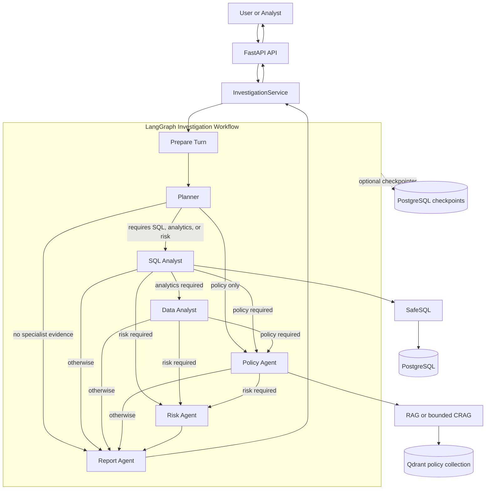
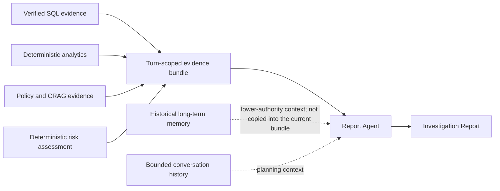
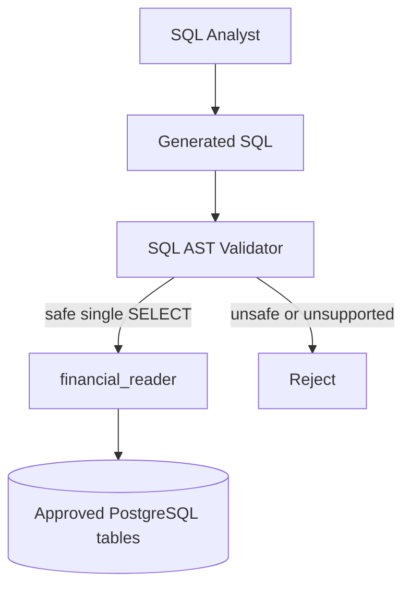
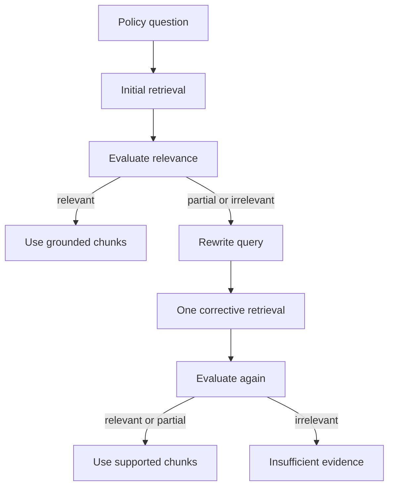
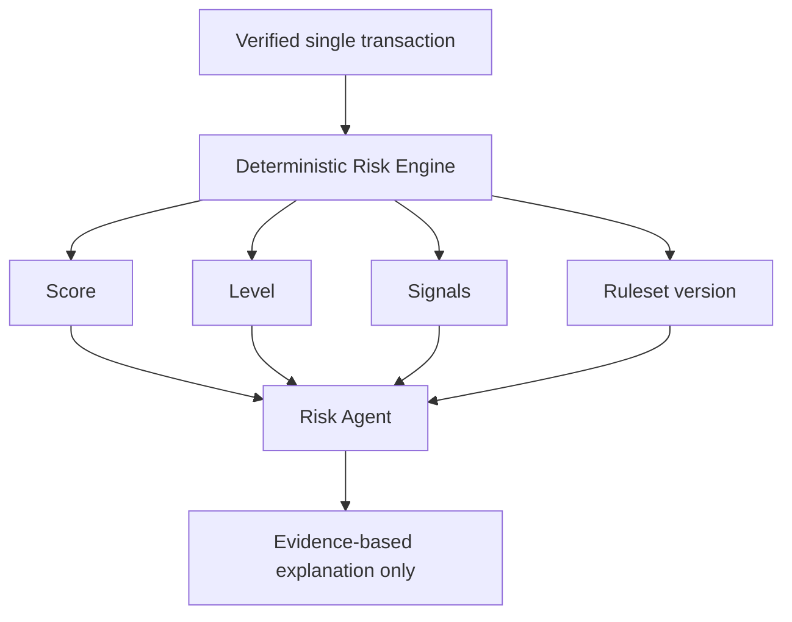
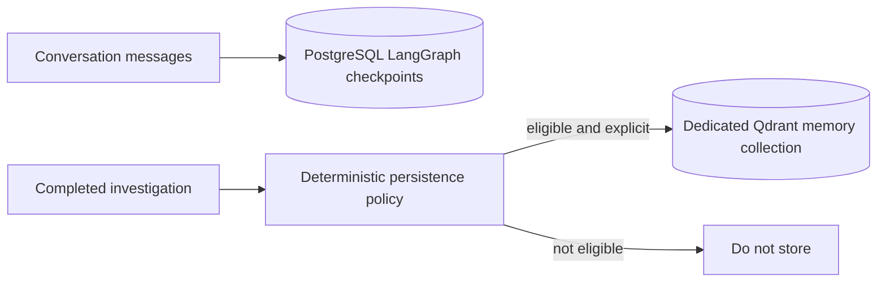
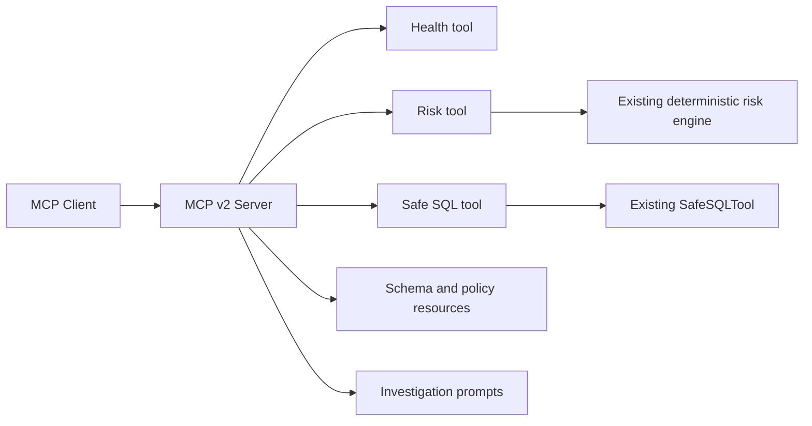
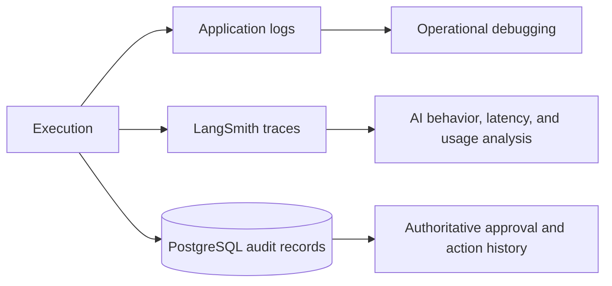

# Financial Intelligence & Risk Platform Architecture

## Purpose

The Financial Intelligence & Risk Platform is an evidence-driven agentic system for investigating financial data, performing deterministic analytics and risk assessment, retrieving policy evidence, and producing grounded investigation reports.

Customer-impacting actions are separated from LLM reasoning and require explicit approval before execution.

The repository is divided into:

- `src/kit` — reusable, domain-independent Agentic AI infrastructure.
- `src/app` — the financial-domain implementation.

The dependency direction is `app -> kit`. The kit must never import application or domain code.

## System Overview



This diagram follows the compiled graph. Specialist execution is sequential: deterministic routers inspect the normalized structured plan after each stage and select the next required capability. The graph also registers a legacy `analyze`/`data_required` branch, but the current primary workflow has no incoming transition to `analyze`.

## Investigation Workflow

The Planner determines which capabilities are required but does not execute tools or financial mutations. Its structured `InvestigationPlan` is normalized before routing. Analytics implies SQL retrieval, and risk analysis implies SQL retrieval. Policy-only questions can route directly to policy retrieval; questions needing no specialist evidence route to reporting.

```text
LLM determines semantic intent
        -> deterministic dependency normalization
        -> deterministic routing and execution
```

The application, not the model, enforces workflow dependencies.

## Evidence Architecture



### Evidence Authority

Evidence does not have equal authority:

1. Current operational facts come from validated current database retrieval.
2. Deterministic analytics derive from verified supplied rows.
3. Policy claims require current policy retrieval and citation metadata.
4. Long-term memory is bounded historical context and cannot override current database or policy evidence.
5. Conversation history helps resolve references but is not authoritative financial evidence.

`prepare_turn` clears prior specialist results before every investigation turn so checkpointed conversation continuity cannot silently reuse stale financial evidence.

## SQL Security



Model-generated SQL has two independent controls. Application validation parses the statement, permits only supported read operations, applies row limits and timeout controls, and rejects mutations or multiple statements. Database authorization then executes accepted queries through `financial_reader`, which has `SELECT` only on approved financial tables. The model never receives trusted application write credentials.

## Corrective RAG



Normal retrieval is the baseline. Correction is bounded to one additional attempt. If useful evidence remains unavailable, the policy result is unanswerable rather than fabricated.

## Risk Assessment



Risk scoring is deterministic, versioned application logic. The LLM cannot choose or modify the score, level, or signals. The Risk Agent explains verified results and available policy context. A high-risk classification is not proof of fraud.

## Memory



Short-term memory is checkpointed graph state keyed by investigation `thread_id`; a configured PostgreSQL checkpointer provides continuity across restarts. Turn-scoped evidence is cleared at the start of a new turn.

Long-term memory is a separate, explicit capability. Eligible transaction investigations are stored as concise records with stable IDs, retention metadata, expiration filtering, and deletion support. It does not replace current SQL evidence or policy retrieval.

## Charts

```text
verified SQL evidence
    -> deterministic analytics
    -> typed ChartSpec
    -> bounded Matplotlib renderer
    -> ChartArtifact
```

The model does not generate or execute arbitrary plotting code. Chart values remain traceable to deterministic analytics results, and output paths and renderer limits are controlled by the application.

## MCP



MCP is a capability-delivery interface, not an alternative security architecture. Handlers delegate to existing implementations and do not duplicate risk rules, SQL validation, or authorization. MCP exposure grants no additional authority; customer-impacting mutations remain behind approval controls and are not exposed as direct MCP tools.

## Observability and Audit



Logs, AI traces, and audit records serve different purposes. PostgreSQL audit events are authoritative for controlled actions. A trace, log entry, report, or model statement is never proof that a customer-impacting action occurred.

## Related Documentation

- [Investigation data flow](data-flow.md)
- [Security architecture](security.md)
- [Architecture decisions](../adr/)
- [Threat model](../threat-model.md)
- [Quality gates](../quality-gates.md)
